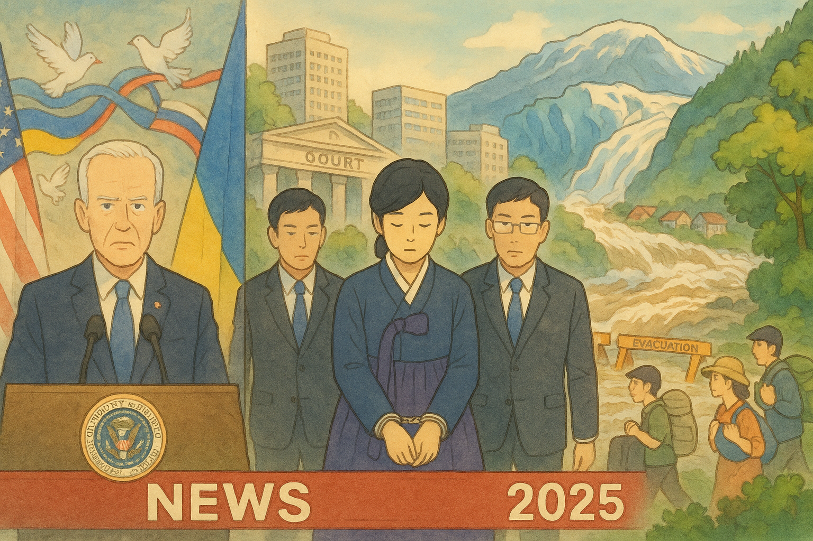

# Global News: Breaking Today (2025-08-14)
_Updated: 2025-08-14 13:07 BST_

  

**Top Lines**
- U.S. President Trump warns of severe consequences for Russia if no Ukraine ceasefire is agreed.
- South Korea's former first lady arrested on corruption charges.
- Juneau, Alaska, under evacuation orders due to Mendenhall Glacier flood threat.

**What Happened**
- **U.S. President Trump's Warning to Russia**: On August 13, 2025, President Donald Trump warned Russian President Vladimir Putin of "very severe consequences" if he does not agree to a ceasefire in the ongoing war in Ukraine. This statement followed discussions with Ukrainian President Volodymyr Zelenskyy and European leaders, where Zelenskyy accused Putin of "bluffing" in his pursuit of peace. ([dailykos.com](https://www.dailykos.com/story/2025/8/13/2338275/-Overnight-News-Digest-August-13-2025?utm_source=openai))

- **South Korea's Former First Lady Arrested**: Kim Keon Hee, the wife of impeached former President Yoon Suk Yeol, was arrested on corruption charges. A Seoul central district court granted the arrest warrant, citing the risk of evidence tampering. The charges include violations of capital market and financial investment laws, as well as political funds laws. Kim denies the charges. ([dailykos.com](https://www.dailykos.com/story/2025/8/13/2338275/-Overnight-News-Digest-August-13-2025?utm_source=openai))

- **Juneau, Alaska, Evacuation Orders**: Residents of Juneau, Alaska, were placed under evacuation orders as the Mendenhall Glacier threatened to release record floodwaters downstream. The glacial lake outburst flood, exacerbated by climate change, posed a significant risk to the city. Authorities anticipated the Mendenhall River to crest on Wednesday, prompting the installation of emergency flood barriers. ([vocm.com](https://vocm.com/2025/08/13/todays-headlines-08-14-25/?utm_source=openai))

**Why It Matters**
- **Impact of U.S. Warning to Russia**:
  - Potential escalation in the Ukraine conflict, affecting regional stability.
  - Implications for international relations and diplomatic efforts.
  - Possible economic sanctions or military responses.

- **Impact of South Korea's Former First Lady's Arrest**:
  - Legal consequences for former presidential family members.
  - Potential impact on public trust and political stability.
  - International attention on South Korea's anti-corruption measures.

- **Impact of Juneau Evacuation Orders**:
  - Immediate safety concerns for residents.
  - Potential environmental and economic effects of the flood.
  - Highlighting the impacts of climate change on infrastructure.

**Key Numbers / Facts**
- Kim Keon Hee faces charges including violations of capital market and financial investment laws, as well as political funds laws. ([dailykos.com](https://www.dailykos.com/story/2025/8/13/2338275/-Overnight-News-Digest-August-13-2025?utm_source=openai))
- Authorities anticipate the Mendenhall River to crest on Wednesday, prompting the installation of emergency flood barriers. ([vocm.com](https://vocm.com/2025/08/13/todays-headlines-08-14-25/?utm_source=openai))

**Timeline (Today, 2025-08-14)**
- **13:07 BST**: Juneau, Alaska, under evacuation orders due to Mendenhall Glacier flood threat.
- **13:07 BST**: South Korea's former first lady arrested on corruption charges.
- **13:07 BST**: U.S. President Trump warns of severe consequences for Russia if no Ukraine ceasefire is agreed.

**Sources**
- [The Guardian – Putin faces ‘very severe consequences’ if no Ukraine truce agreed, Trump says](https://www.theguardian.com/world/2025/aug/13/putin-faces-very-severe-consequences-if-no-ukraine-truce-agreed-trump-says) — published 2025-08-13 23:38 BST
- [The Guardian – South Korea’s former first lady arrested after court issues warrant on corruption charges](https://www.theguardian.com/world/2025/aug/13/south-korea-former-first-lady-arrested-corruption-charges) — published 2025-08-13 23:38 BST
- [VOCM – Today’s Headlines (08/14/25)](https://vocm.com/2025/08/13/todays-headlines-08-14-25/) — published 2025-08-13 23:38 BST 